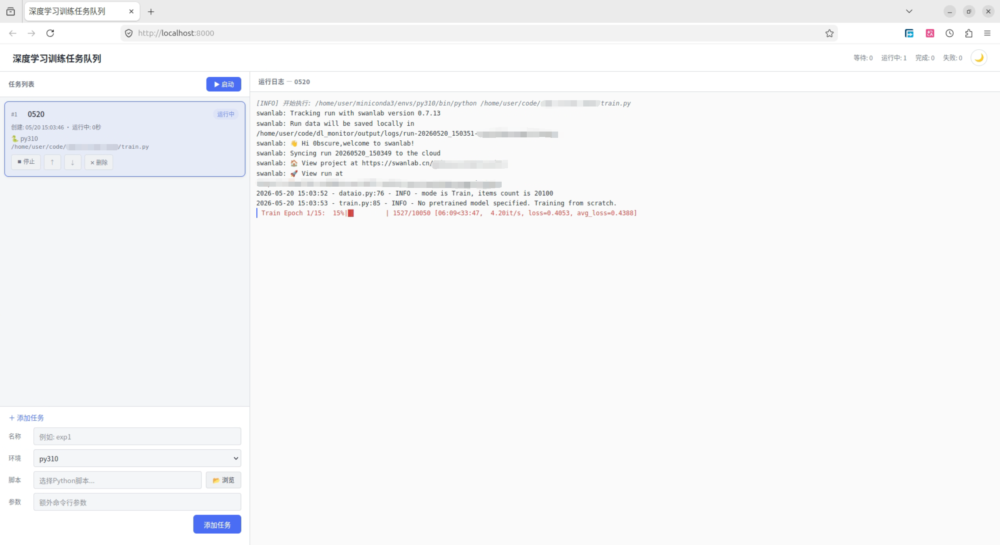

# 深度学习后台监控工具

## 功能
- 监控深度学习训练过程
- 编排任务顺序流
- 顺序执行命令，上一个跑完自动跑下一个
- Web UI 实时查看队列状态、运行日志
- 随时添加/删除/重排队任务
- 失败自动标记并跳过，不影响后续任务
- 单文件，零依赖
- 支持conda环境选择
- 支持亮/暗主题切换

## 技术栈
- Python
- FastAPI
- Unicorn

## 项目背景
我的深度学习模型训练需要花费10-12个小时，昨天挂了一个模型训练，训练到了凌晨3点，但当时我在休息。当我早上8点起床后，才开始运行下一次训练，这浪费了服务器5个小时的算力。所以我需要一个自动任务执行工具，当上一次实验结束后，自动开始下一个实验。大概消费了一瓶可乐钱VIBE了一个工具出来，感觉还算能用，小小的开源一下~

## 软件界面

